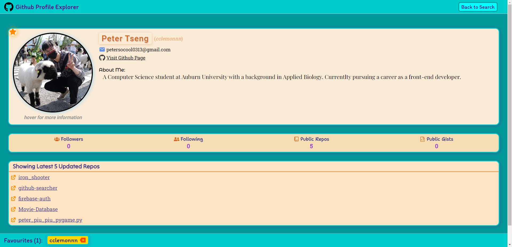
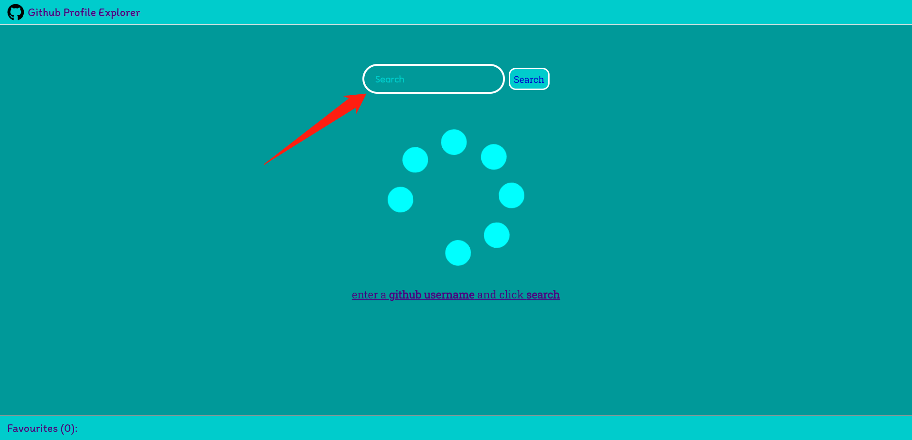
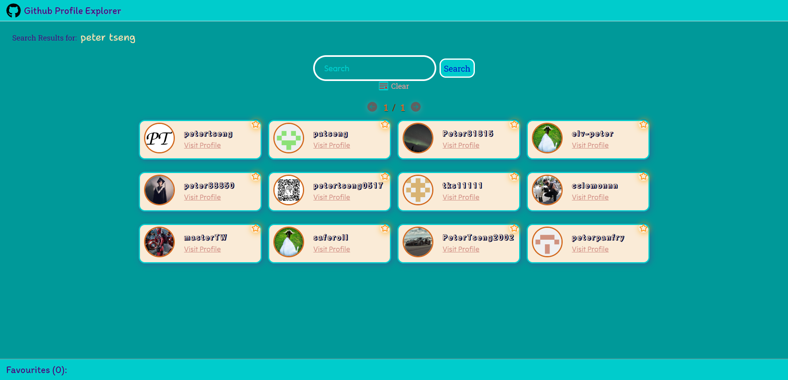
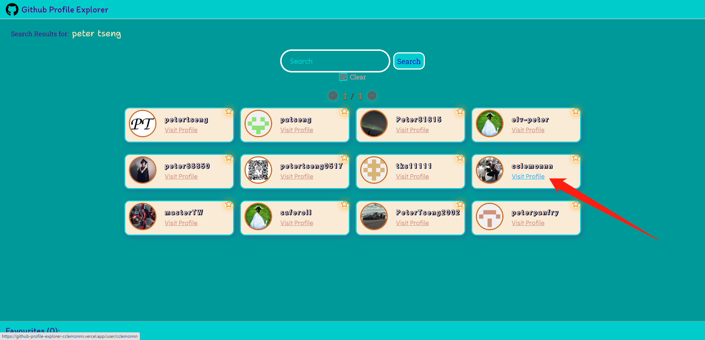
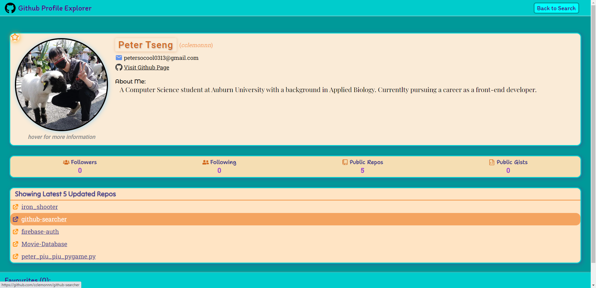
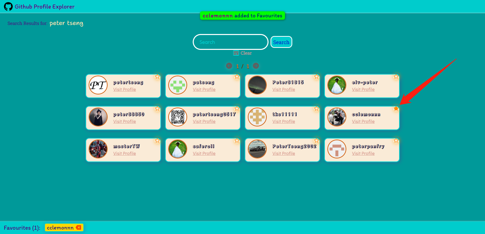
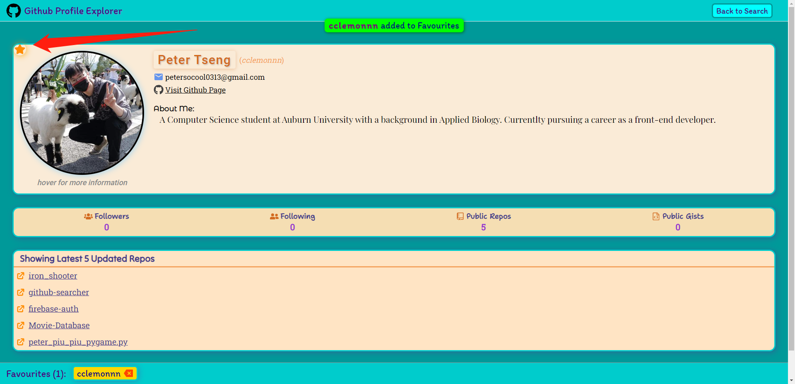
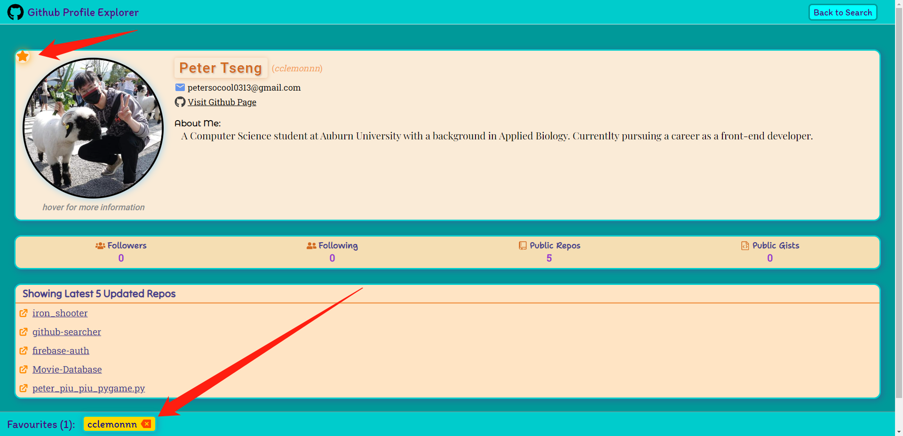

# Github Profile Explorer

**App URL:** https://github-profile-explorer-cclemonnn.vercel.app/

This app allows you to search up Github user profile and save favourite users to a list. Each user profile contains detailed information about the user.

此專案可以搜尋 Github 使用者個人檔案，並且儲存喜歡的使用者至收藏夾。每個使用者個人檔案都包含有關該使用者的詳細信息。

---

## Project Skills (專案技能)

React (React Router v6), Github REST API, Local Storage, Javascript (ES6), CSS3, and HTML5.

---

## Features (功能)

### Search Users (搜尋使用者)

- You can search for Github users using either a username or the public name provided by the user.

- 可以使用使用者名或使用者提供的姓名搜索 Github 使用者。

### User Profile (使用者個人檔案)

- You can visit a Github user's profile by clicking "Visit Profile" in the user profile card. Each user profile contains links to user's Github page, repositories, and Twitter.

- 可以通過在 Github 使用者個人檔案卡片中點擊 “Visit Profile” 來訪問用戶的個人檔案。每個使用者個人檔案都包含連接到使用者的 Github 頁面、repositories 和 Twitter。

### Favourites (收藏夾)

- You can add up to 5 Github users to your Favourites by clicking the star button on the user profile card or at the top left of each profile.

- 通過在每個使用者個人檔案卡片的右上方或個人檔案左上方的星形按鈕上點擊來將最多 5 個 Github 使用者添加到收藏夾中。

- To remove a Github user from the Favourites, you can either click the star button again or click the X-mark of the user in the Favourites.

- 若要從收藏夾中刪除 Github 使用者，再次點擊星形按鈕或點擊收藏夾中使用者的 X 標記。

- Favourites is saved in local storage so that it persists across sessions.

- 收藏夾保存在 Local Storage 。
